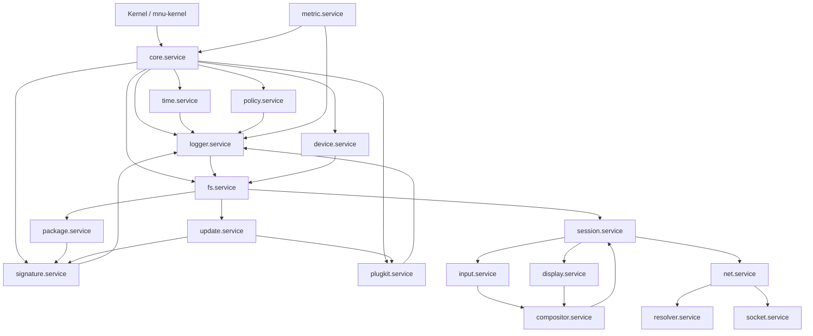

# サービス構成

mochiOS は、`core.service` を起点にユーザー空間サービスを起動する構成を取ります。

## まず実装する範囲

- `core.service`
    - 常駐
    - `logger.service` を起動する
    - 将来のサービス監督の中心
- `logger.service`
    - 最小の常駐 logger
    - 後で IPC ベースのログ集約に拡張する

## 依存の考え方

- `core.service` は最上位のユーザー空間プロセス
- `logger.service` は `core.service` から起動される最初の従属サービス
- `signature.service` と `plugkit.service` は信頼・拡張系の中核
- `fs.service` と `device.service` は OS の実用機能の土台

