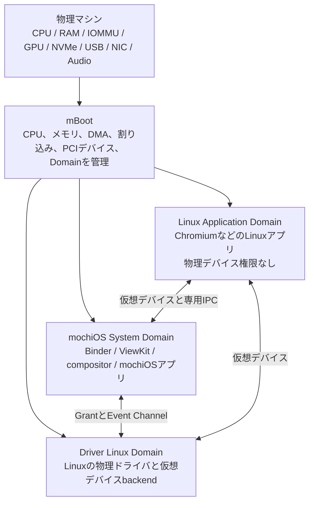
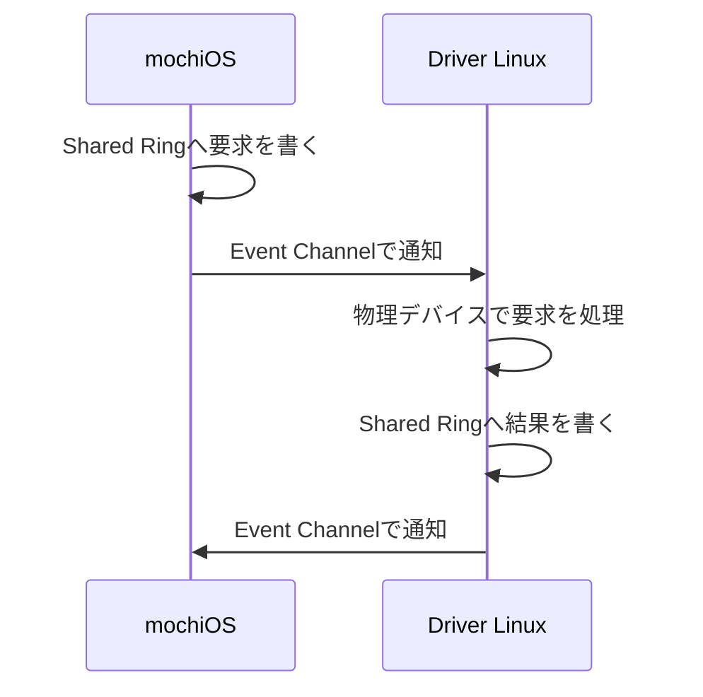
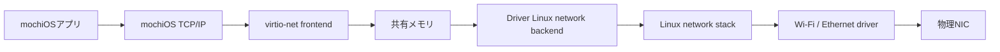
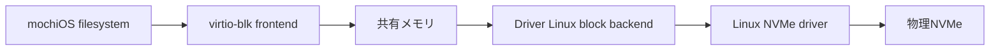
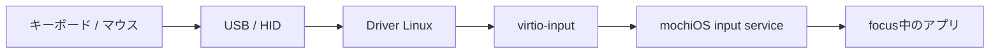
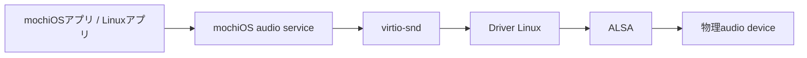
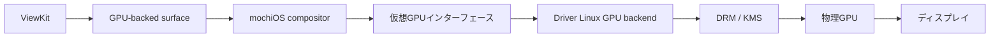
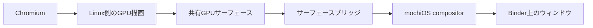
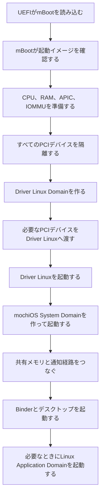

# mBootについて

> [!IMPORTANT]
> この文書で説明しているmBootは、2026-08-23時点で実装されているLinuxベースのmBootとは
> 別のものです。現在動いているmBootを説明した文書ではありません。

mBootは、物理マシンとmochiOSの間で動くmnuベースのハイパーバイザーです。CPU、メモリ、割り込み、PCIデバイスなどを管理し、複数のOSを互いに隔離して動かします。

ユーザーが触るOSはmochiOSです。Linuxは物理デバイスを動かすために使います。ChromiumやCounter-Strike 2などのLinuxアプリは、デバイス用Linuxとは別の仮想マシンで動かします。

## 全体像

mBootが物理資源の所有者です。mochiOSやLinuxは必要な資源のみ保有しており、ほかのDomain（後述します）のメモリやデバイスには触れられないようになっています。

## Domain

mBootの上で動く仮想マシンを`Domain`と呼びます。

| Domain | 役割 | 物理デバイス |
|---|---|---|
| mochiOS System Domain | デスクトップ、アプリ、権限、システムポリシー | 原則として持ちません |
| Driver Linux Domain | Linuxのドライバを使って物理デバイスを動かします | mBootが許可したもののみ |
| Linux Application Domain | ChromiumなどのLinuxアプリを動かします | 持ちません |

mochiOSとLinux Application Domainは兄弟関係にあり、Linux Application DomainがmochiOSの内部で動くわけではありません。mochiOSはmBootへ起動や停止を依頼し、mBootがDomainを管理します。

## mBootの役割

mBootは、物理マシン全体の資源を管理します。

| 資源 | 分け方 |
|---|---|
| CPU | mochiOS、Driver Linux、Linux Application DomainへvCPUを割り当てます |
| RAM | mBootと各Domainの専用領域に分け、許可したpageだけ共有します |
| PCIデバイス | GPU、NVMe、xHCI、NICなどを、mBootが指定したDomainへ割り当てます |

mBootが受け持つのは、次のような処理です。

- CPUの仮想化とvCPUの実行
- Domainごとのメモリ分離
- IOMMUを使ったDMAの制限
- PCIデバイスの所有権
- 物理割り込みと仮想割り込み
- Domain間で共有するメモリの管理
- Domain間の通知
- Capabilityの確認
- Domainの起動、停止、再起動
- Domainが止まったときの資源回収
- 起動するイメージの確認

mBootは一般的なデスクトップOSとしては動きません。GUI、一般アプリ、TCP/IP、GPUドライバ、USBドライバ、Wi-Fiドライバなどは持ちません。

## mochiOS System Domain

mochiOSは、ユーザーが直接使うメインのOSです。

mochiOSでは、次のものが動きます。

- デスクトップ環境（Binder）
- compositor
- 各種mochiOSアプリ
- アプリの権限管理
- ユーザーセッション
- Linuxアプリの起動管理
- 仮想デバイスのフロントエンド

mochiOSは物理GPUや物理NVMeを直接操作しません。Driver Linuxが公開する以下の仮想デバイスを利用します。

- `virtio-net`
- `virtio-blk`
- `virtio-input`
- `virtio-snd`
- `virtio-gpu`

このため、mochiOS側で大量の機種別ドライバを抱える必要がありません。mochiOSは少数の仮想デバイスを扱い、物理デバイスの違いはDriver Linuxが引き受けます。

mochiOSはDomainの起動を管理しますが、mBootのメモリやIOMMUを直接変更できず、Application Domainの作成など、許可された操作だけをmBootへ依頼できます。

## Driver Linux Domain

Driver Linuxは、Linuxのドライバ資産を使うためのDomainです。Linuxデスクトップとしてユーザーが操作するものではありません。

Driver Linuxには、次のドライバおよびモジュールが入っています。

- amdgpu、i915、nouveau
- NVMe
- xHCI、USB、HID
- Wi-FiとEthernet
- ALSA
- Bluetooth
- DRMとKMS
- mochiOS向けの仮想デバイスバックエンド

Driver Linuxが操作できるのは、mBootから割り当てられたPCIデバイスだけです。Linuxから見えるメモリも、自分のRAMと明示的に共有された領域に限ります。

| DMAのアクセス先 | 結果 |
|---|---|
| Driver LinuxのRAM | 許可 |
| 共有I/Oバッファ | 許可 |
| mochiOSの通常RAM | 拒否 |
| Linux Application DomainのRAM | 拒否 |
| mBootのRAM | 拒否 |

IOMMUはメモリへの不正なDMAを防ぎます。ただし、Driver Linuxは入力、画面、disk、networkの内容を扱います。I/Oの内容については、Driver Linuxを信頼する必要があります。

Driver Linuxではアプリを動かさず、ログイン画面、一般ユーザー向けのシェル、パッケージマネージャー、外部から接続する管理サービスも置かずに必要なドライバ、ファームウェア、バックエンドだけを含むLinuxとして扱います。

## Linux Application Domain

ChromiumなどのLinuxアプリは、Driver Linuxと別のDomainで動きます。

Linux Application Domainには、Linuxカーネルとuserspace、Chromium、そしてみんなが大好きなCounter-Strike 2などのアプリを入れます。利用できるデバイスは、仮想ネットワーク、仮想ディスク、仮想画面、仮想入力、仮想音声だけです。

このDomainには物理PCIデバイスを渡しません。ChromiumやLinuxユーザー空間が侵害されても、物理GPU、NVMe、USB controller、NICを直接操作できないようにします。

LinuxアプリのウィンドウはmochiOSのコンポジタへ渡し、Binderがほかのウィンドウと一緒に管理します。キーボードやマウスの入力も、mochiOSがフォーカスと権限を確認してからLinux Application Domainへ送ります。

クリップボード、ファイルアクセス、マイク、カメラ、スクリーンキャプチャもmochiOSの権限管理を通し、そしてLinux Application DomainへはmochiOSのファイルシステム全体を見せません。ユーザーが選んだファイルもしくはディレクトリのみをポータル経由で渡します。

## Domain間の通信

Domain間の通信では、大きなデータをmBootが何度もコピーせずに共有メモリと通知を組み合わせて行います。

| 仕組み | 役割 |
|---|---|
| Grant | 指定したメモリページを、指定したDomainと共有します |
| Event Channel | 共有キューに新しい要求や応答が入ったことを通知します |
| Shared Ring | 共有メモリ上で要求と応答を受け渡します |

通信の流れは次のようになります。

mBootは共有してよいメモリか、正しい相手へ通知しているか、必要なCapabilityを持っているかを確認します。ネットのパケットやディスクのブロックの内容そのものは処理しません。

小さな管理要求と、大量のデータを運ぶ経路も分けます。

| 経路 | 扱うもの |
|---|---|
| Control Path | Domainの起動、停止、接続、権限などを扱います |
| Data Path | ネットワーク、ディスク、画面、入力、音声のデータを扱います |

## Network

SSIDのスキャン、接続、切断、airplane modeもDriver Linuxが物理デバイスへ反映します。Settings.appは専用の制御経路を通してDriver Linuxへ要求します。

Linux Application Domainも仮想ネットワークを使います。物理NICへは触れず、Driver LinuxがルーティングやNATを行います。

## Storage

ファイルシステムはmochiOSが管理します。Driver LinuxはmochiOS用の領域をマウントせず、ブロックデバイスとして読み書きするだけです。

Driver Linuxがディスクへの書き込み途中で止まった場合、書き込みが完了したか判断できないことがあります。そのため、Driver Linuxを再起動しただけで常に安全に続行できるとは扱いません。

その際はmochiOSはファイルシステムを停止し、必要なら整合性を確認してから再開します。安全を確認できない場合はmochiOSも再起動します。

## 入力

Linux Application Domainへ入力を送るかどうかはmochiOSが決めます。なぜならフォーカスされていないLinuxアプリがほかのアプリ向けの入力を受け取ってはならないからです。パスワードなどの入力中は、許可されていないDomainへキーボードイベントを送りません。

## 音声

複数のアプリから出た音は、mochiOSのオーディオサービスがまとめます。マイクを使う場合も、mochiOSがユーザーの許可を確認してから音声を渡します。

## 画面

物理GPUのドライバは前述したとおりDriver Linuxが保持し、mochiOSは仮想GPUインターフェース（virtio-gpu）を通してGPUを利用します。

ViewKitはGPU上に確保されたサーフェースへ描画します。mochiOS compositorは各サーフェースの位置、重なり順、クリッピング、透明度、変形を管理し、合成処理をGPUへ送ります。

Driver Linuxは次の処理のみを担当します。

- 物理GPUの初期化とドライバ管理
- GPUメモリの割り当てと共有
- mochiOSから受け取ったGPUコマンドの実行
- fenceを使用した描画同期
- DRM/KMSによる画面モード設定
- 合成済みフレームのscanout

ウィンドウの配置、重なり順、表示領域、入力フォーカスはmochiOSが決定します。Driver Linuxはウィンドウの存在を認識せず、GPUリソースと表示装置を提供するバックエンドとして動作します。

Linux Application DomainのアプリケーションもGPUをバックエンドとしたサーフェースへ描画します。サーフェースは共有GPUバッファとしてmochiOSへ渡され、通常のmochiOSアプリケーションと同じようにコンポジタが管理します。

Chromiumの例:

共有にはDMA-BUF相当のバッファ共有機構とfenceによる同期を使用します。Linux Application Domainはサーフェースの内容を描画できますが、その表示位置や重なり順を直接変更することはできません。

通常の画面出力ではCPU共有フレームバッファを使用しません。共有フレームバッファはGPUが利用できない場合の起動画面、障害表示、復旧用フォールバックとしてのみ残します。

## 起動

起動時は、mBootが各Domainとデバイスの割り当てを先に確認します。

Driver Linuxを先に起動するのは、mochiOSが使う画面、入力、storageなどを準備するためです。

## Capability

mBootのCapabilityは、Domainが操作できる対象を制限します。

mochiOSには、許可されたApplication Domainを作る権限や、通信経路を作る権限を渡します。ただし、物理メモリ、IOMMU、任意のPCIデバイスを直接操作する権限は渡しません。

Driver Linuxには、割り当てられたdevice、IRQ、DMA buffer、backend用の通信経路を使う権限を渡します。ほかのPCIデバイスやDomainのメモリは操作できません。

どのDomainにも渡さない権限もあります。

- ハイパーバイザーのメモリを変更する権限
- 任意の物理メモリを読む権限
- IOMMUを直接変更する権限
- 割り当てられていないPCIデバイスを操作する権限
- 物理割り込みの配送先を自由に変える権限

mochiOSがApplication Domainを作る場合も、署名済みの種類から選びます。RAM、vCPU、接続できる仮想デバイスなどには上限を設けます。

## 信頼する範囲

mBootは、ほかのDomainより強い権限を持ちます。mBootが壊れると、すべてのDomainの隔離へ影響します。そのため、mBootには仮想化と資源管理に必要な処理だけを置きます。

mochiOSはシステム管理を担当しますが、mBootの内部を直接変更できません。mochiOSの一般アプリは、さらにmochiOSのCapabilityと権限確認によって制限されます。

Driver Linuxは、mBootやmochiOSの通常RAMへアクセスできません。しかし、物理I/Oの内容には触れられます。

Driver Linuxは、技術的には次のことができます。

- 入力を読み取る
- 画面内容を読む、または差し替える
- ディスクI/Oを変更する
- ネットワークパケットを読む、変更する、捨てる
- デバイスを停止させる

IOMMUが防ぐのは、Driver Linuxやデバイスから許可されていないRAMへのアクセスです。入力やディスクの内容が正しいことまでは保証しません。（というよりもろもろの理由により保証できません）

このためDriver Linuxは、ユーザーデータに関して信頼するシステムコンポーネントとして扱います。

Linux Application Domainと、その中で動くアプリは信頼しません。物理デバイスを渡さず、mochiOSが許可した仮想デバイスとportalだけを利用させます。

## どこかが止まったとき

### Driver Linux

Driver Linuxが停止した場合、mBootはDriver LinuxのvCPUを止め、deviceからのDMAと割り込みを無効にします。共有していたメモリも回収します。

mochiOSでは、使えなくなったdeviceを一時的に利用不可として扱い、それをもとにmochiOSはユーザーへウィンドウなどを利用して明示的なエラーを表示します。

- `Network unavailable`
- `Storage unavailable`
- `Display backend restarting`
- `Input backend restarting`

ネットワーク、入力、オーディオはDriver Linuxの再起動後に接続し直せます。ストレージは書き込みの状態が不明になることがあるため、ファイルシステムの確認が必要です。

GPUや一部のPCIデバイスは、実行中に安全にリセットできない場合があります。その場合はDriver Linuxだけを再起動せず、物理マシンを再起動します。

### mochiOS

mochiOSが停止した場合、mBootはmochiOSが使っていた共有メモリ、通知経路、Application Domainを回収します。Driver Linuxはそのまま動かし、mochiOSだけを再起動できます。

mochiOSの再起動中は、古いセッションで使っていたfile portal、クリップボード、入力フォーカスを無効にします。

### Linux Application Domain

Linux Application Domainが停止した場合は、そのDomainだけを回収します。Binderは該当するwindowを閉じ、アプリが停止したことをユーザーへ知らせます。ほかのアプリやDriver Linuxは停止しません。

### mBoot

mBoot自身が壊れた場合は、Domainを動かし続けません。可能な範囲でdeviceのDMAを止め、障害内容を記録して物理マシンを再起動します。

再起動後、mochiOSは可能な限り前回のセッションを復元します。Driver Linuxは、再起動後に物理デバイスを再初期化します。

その後、mochiOSはユーザーにクラッシュレポートを表示し、問題が発生したこと、そして発生した問題が解決したかどうかを表示し、ネットワークが生きている場合はユーザーから明示的な同意を得てクラッシュレポートを送信します。

## まとめ

| レイヤ | 役割 |
|---|---|
| mBoot | CPU、RAM、DMA、割り込み、device、Domainを管理します |
| mochiOS | デスクトップ、アプリ、権限、システムポリシーを管理します |
| Driver Linux | Linuxのドライバを使って物理デバイスを動かします |
| Linux Application Domain | ChromiumなどのLinuxアプリを、物理デバイスから隔離して動かします |

Linuxのドライバ資産は利用しますが、Linuxを物理マシン全体の管理者にはしません。mBootがLinuxへ必要なdeviceだけを渡し、mochiOSをユーザー向けのメインOSとして動かします。
